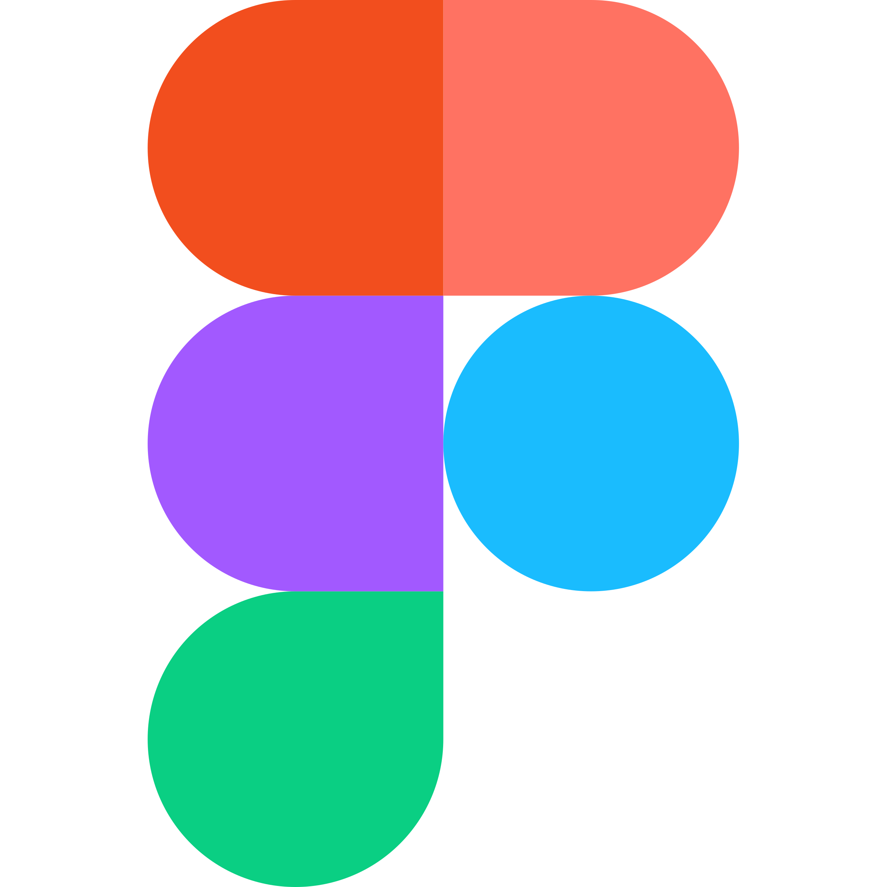

# Quoc Huy Do
Étudiant de TIM au Collège Montmorency

## Formation
**Technique d'intégration multimedia** (Diplome d'Étude Collégial)  
[Collège Montmorency](https://www.cmontmorency.qc.ca/) (2021 - 2024)

## Compétences
- Apte en **modélisation 3D**
- Apte dans la création du **pixel art**
- Apte en **Photoshop**
- Habile en **JavaScript**, **HTML** et **CSS**
- Connaissance de base en **LUA**
- Connaissance de base en conception de niveaux de jeux vidéos

## Logiciels
-  **Aseprite**
-  **Maya**
-  **Photoshop**
-  **Figma**
-  **Visual Studio Code**
-  **Roblox Studio*

## Qualités
- Ponctuel
- Créatif
- 
