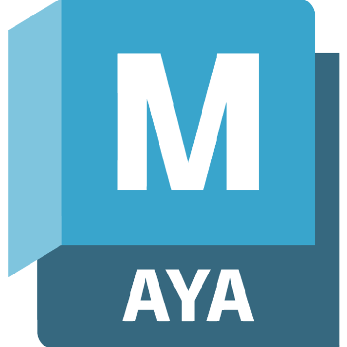

# Quoc Huy Do

## Objectif
Apprendre de nouvelles compétences et améliorer m'améliorer en modélisation 3D, pixel art et design.

## Formation

**Techniques d'intégration multimedia** (Diplome d'Étude Collégial)  
[Collège Montmorency](https://www.cmontmorency.qc.ca/) (2021 - 2024)

**Concentration Multimédia** (Diplome d'Étude Secondaire)  
[Mont-de-La Salle](https://montdelasalle.cslaval.qc.ca/) (2018 - 2021)

## Expérience

**Stagiaire en graphic design** 
[Immersia](https://immersia.ca/) (Été 2024)

- Pour la dernière session de CÉGEP, j'ai fait un stage chez Immersia, une compagnie de jeux d'évasion. Mon mandat était de faire les éléments visuels tels que les interfaces pour des écrans et des cartes d'accès pour leur prochain jeu d'évasion. Images ne sont pas encore disponible sur mon portfolio puisque le jeu est encore en développement.

**Modélisateur et Animateur 3D** 
[TLL Studios](https://www.roblox.com/groups/2755650/TLL-Studios#!/about) (2020 - Présent)

Groupe ROBLOX qui développe des petits jeux de temps en temps.

- Modélisateur 3D, Animateur, Concepteur et Artiste dans les jeux suivant:
  - [SCP: Facility Breach](https://www.roblox.com/games/10192723897/SCP-Facility-Breach)
  - [Deathsworn](https://www.roblox.com/games/13202913676/Deathsworn)
  - [Anime Girl RNG](https://www.roblox.com/games/17247823100/Anime-Girl-RNG)
  
## Compétences
- Apte en **modélisation 3D**
- Apte dans la création du **pixel art**
- Apte en **Photoshop**
- Habile en **Montage vidéo**
- Habile en **JavaScript**, **HTML** et **CSS**
- Connaissances de base en conception de niveaux de jeux vidéos

## Prix
- Concours d'essai audiovisuel de la Techniques d'intégration multimédia (2024)

## Nominations
- Concours d'essai audiovisuel de la Techniques d'intégration multimédia (2023)

## Logiciels
-  **Aseprite**
-  **Blender**
-  **Photoshop**
-  **DaVinci Resolve**
-  **Figma**
-  **Maya**
-  **Visual Studio Code**

## Qualités
- Ponctuel
- Créatif
- Débrouillard

## Références
Disponible sur demande
